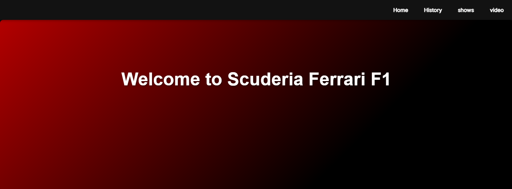
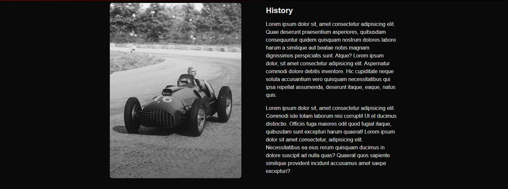
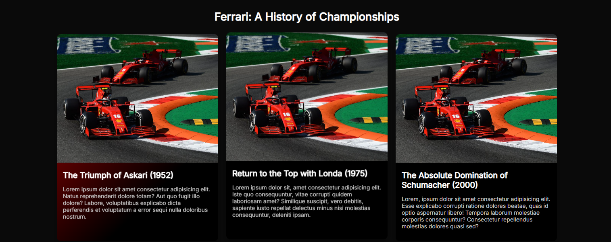
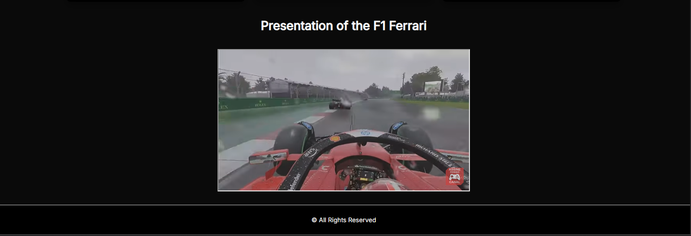

🏎️ Ferrari F1 Dark Mode Web Template

 

Project Description

A modern, fully custom HTML, CSS, and JavaScript template inspired by the iconic visual identity of Scuderia Ferrari in Formula 1. The design combines the intense Rosso Corsa red with deep black tones to create a bold, high-contrast interface that captures the spirit of Ferrari - speed, precision, and performance.

The template focuses on delivering a dynamic and immersive racing-inspired user interface, while maintaining clean structure and high performance. Every component is designed with attention to visual detail, smooth transitions, and responsive behavior to ensure a consistent experience across all devices.

Built without external frameworks, the project emphasizes lightweight architecture, maintainable code, and fast loading speeds, making it suitable both as a design showcase and as a foundation for real web projects.

🔥 Live Demo:
https://f1-colors-template.netlify.app/

Features

🔴 Ferrari-inspired Rosso Corsa red and black color palette

🌑 Dark mode interface with smooth UI transitions

📱 Fully responsive layout optimized for mobile, tablet, and desktop

🎨 Custom UI components inspired by Formula 1 design aesthetics

⚡ High performance and lightweight structure

🧩 Clean and modular code organization

🚫 No frameworks — built with pure HTML, CSS, and JavaScript
