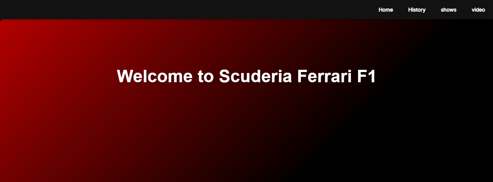
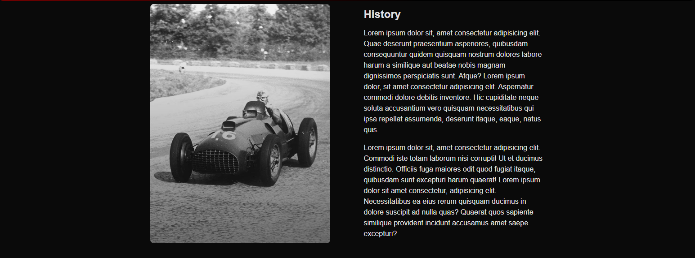
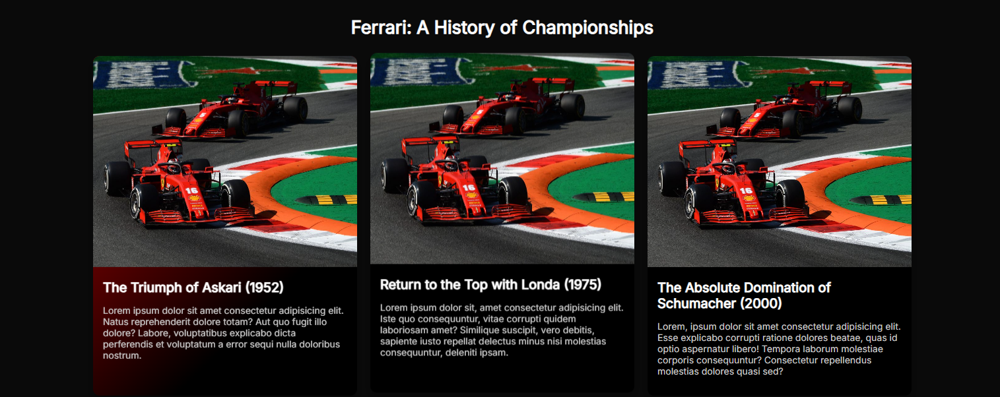
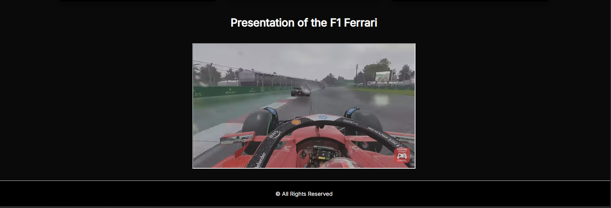

# 🏎️ Ferrari F1 Dark Mode Web Template 
 

 
 

# Project Description

A modern, fully custom HTML, CSS, and JavaScript template inspired by the iconic visual identity of Scuderia Ferrari in Formula 1. The design combines the intense Rosso Corsa red with deep black tones to create a bold, high-contrast interface that captures the spirit of Ferrari - speed, precision, and performance.

The template focuses on delivering a dynamic and immersive racing-inspired user interface, while maintaining clean structure and high performance. Every component is designed with attention to visual detail, smooth transitions, and responsive behavior to ensure a consistent experience across all devices.

Built without external frameworks, the project emphasizes lightweight architecture, maintainable code, and fast loading speeds, making it suitable both as a design showcase and as a foundation for real web projects.
---
🔥 Live Demo:
https://f1-colors-template.netlify.app/
 
# Features
---
🔴 Ferrari-inspired Rosso Corsa red and black color palette

🌑 Dark mode interface with smooth UI transitions

📱 Fully responsive layout optimized for mobile, tablet, and desktop

🎨 Custom UI components inspired by Formula 1 design aesthetics

⚡ High performance and lightweight structure

🧩 Clean and modular code organization

🚫 No frameworks - built with pure HTML, CSS, and JavaScript

🏎️ Ferrari F1 Dark Mode Web Template

Περιγραφή Έργου

Ένα σύγχρονο, πλήρως προσαρμοσμένο πρότυπο HTML, CSS και JavaScript, εμπνευσμένο από την εμβληματική οπτική ταυτότητα της Scuderia Ferrari στη Formula 1. Ο σχεδιασμός συνδυάζει το έντονο Rosso Corsa κόκκινο με βαθιές μαύρες αποχρώσεις, δημιουργώντας ένα τολμηρό περιβάλλον υψηλής αντίθεσης που αποτυπώνει το πνεύμα της Ferrari - ταχύτητα, ακρίβεια και απόδοση.

Το πρότυπο επικεντρώνεται στην παροχή ενός δυναμικού και καθηλωτικού περιβάλλοντος χρήστη, εμπνευσμένου από τους αγώνες, διατηρώντας παράλληλα καθαρή δομή και υψηλή απόδοση. Κάθε στοιχείο έχει σχεδιαστεί με προσοχή στη visual λεπτομέρεια, ομαλές μεταβάσεις και responsive συμπεριφορά, ώστε να εξασφαλίζεται μια συνεπής εμπειρία σε όλες τις συσκευές.

Κατασκευασμένο χωρίς εξωτερικά frameworks, το έργο δίνει έμφαση σε ελαφριά αρχιτεκτονική, ευκολία συντήρησης του κώδικα και γρήγορους χρόνους φόρτωσης, καθιστώντας το κατάλληλο τόσο ως showcase σχεδιασμού όσο και ως βάση για πραγματικά web projects.

🔥 Live Demo:
https://f1-colors-template.netlify.app/

Χαρακτηριστικά

🔴 Παλέτα χρωμάτων εμπνευσμένη από τη Ferrari, με Rosso Corsa κόκκινο και μαύρο

🌑 Περιβάλλον dark mode με ομαλές μεταβάσεις στο UI

📱 Πλήρως responsive διάταξη, βελτιστοποιημένη για κινητά, tablet και desktop

🎨 Προσαρμοσμένα UI components εμπνευσμένα από την αισθητική σχεδιασμού της Formula 1

⚡ Υψηλή απόδοση και ελαφριά δομή

🧩 Καθαρή και modular οργάνωση κώδικα

🚫 Χωρίς frameworks - κατασκευασμένο με καθαρό HTML, CSS και JavaScript
